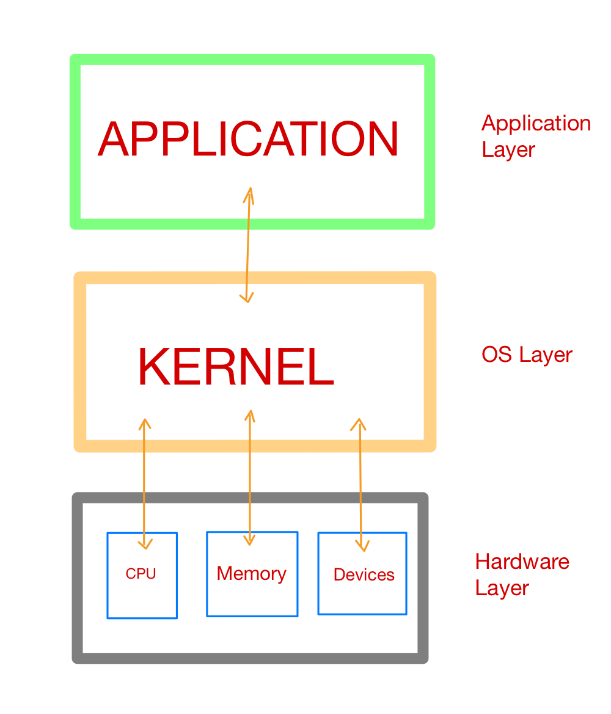

## What is Memory Management?
Memory management is a procedure by which applications or program to read and write some data from memory. A memory manager determines where to put application’s data. Since there’s  only a finite chunk of memory available to us.

This process of giving access to memory to a program or application is by in large called memory allocation. On top of hardware layers such as RAM or a hard drive is their an operating system (OS) layer which consists of a *Kernel* which can be considered as the operating  system code that is responsible for interaction of hardware and software components. A *kernel* is the first program that loads at startup after bootloader and having a seperate reserved memory space from programs and applications.  It carries out (or denies) requests to read and write from memory.



Memory management for your Python code is handled by the Python application or process. Above the OS layer, there are applications and processes at application layer, one of which is the Python application or processes.


### How it is implemented in Python?
The default Python execution, `CPython`, is actually written in the C programming language. Yet, there are executions other than `CPython`. For instance, `Jython` arranges down to Java `bytecode` to run on the Java Virtual Machine.

Python is an interpreted programming language. Our Python code actually gets compiled down to more computer-readable instructions called as `bytecode`. Then these instructions gets interpreted by a virtual machine when we run our code.

Usually in Cpython implementation, `.pyc` file or a `__pycache__` folder will be created after compilation. `.pyc`contains all the `bytecode` which gets interpreted by the virtual machine.

Virtual machines are very much similar to physical computers except they are implemented in software.

`CPython` is written in C, and it interprets Python `bytecode` after compilation.

### What does this have to do with memory management?

Well, the memory management algorithms and structures exist in the `CPython` code, in C. To understand the memory management of Python, we have to get a basic understanding of `CPython` itself.

#### `Cpython`
Everything in Python is an object, even types such as `int` and `str.` Well, it’s true on an implementation level in `CPython`. There is a struct called a `PyObject`, which every other object in `CPython` uses.

A struct, or structure, in C is a custom data type that groups together different data types.
PyObject, the archetype of all objects in Python, contains only two things:
- `ob_refcnt`:Reference Count
    -  Reference count is used for garbage collection
    -   Python allows you to inspect the current reference count of an object with the `sys` module. We can use `sys.getrefcount(numbers)`, but should be kept in mind that passing in the object to `getrefcount()` increases the reference count by 1.
    - In any case, if the object is still required need to be hang around in our code, its reference count is greater than 0. Once it drops to 0, the object has a specific deallocation function that is called which “frees” the memory so that other objects can use it.
- `ob_type`: Pointer to another Type
    - Then you have a pointer to the actual object type. That object type is just another struct that describes a Python object (such as a dict or int)

Each object has its own object-specific memory allocator that knows how to get the memory to store that object. Each object also has an object-specific memory deallocator that “frees” the memory once it’s no longer needed

Every python process needs some memory and resources. Memory management in Python involves a private heap containing all Python objects and data structures.  Management of this heap is done internally by *Python Memory Manager.* It has many software component for managing different memory management tasks such segmentation, preallocations, caching etc.

At a very low level, a raw memory allocator always ensures that there is enough space in private heap for all python related data by interacting with memory manager. Furthermore, this memory is divided into two parts:
- Stack Memory
    - Stack memory is the contiguous blocks of memory allocated in the function call stack or we can say that, It is the storage of static memory inside a particular function or method call. The size of this memory that need to be allocated is known to the compiler and whenever a function is called, its variables get memory allocated on the stack.
    - Any local memory assignments inside function block are stored temporarily on the function call stack, it gets deleted once the function returns and call stack moves another function or task.
- Heap Memory
    - This memory is allocated during the execution of instruction written in the program in the global scope. This heap memory has nothing to do with heap data structure. Since heap memory is just a pile of memory available to programmer to allocate and de-allocate.
    - Management of this private heap is done by interpreter, user have no control over it.

    The methods/method calls and the references are stored in stack memory and all the values objects are stored in a private heap.  Example of this process 

    ```python
            def func1(num: int):
            				return num = func2(num)
            def func2(num: int):
            				return num * 2

            if __name__ == "__main__":
            				val = 7
            				result = func1(someNum)
            	
    ```

    Can be visualised as  

    

## Allocation and Deallocation in `Cpython`
Memory is a shared resource between applications and processes on the computer, and bad things can happen very easily if two different processes try to write to the same location simultaneously.

When two threads try to modify the same resource or memory at the  exactly same time, things can get messy very easily which results in such a mess where neither of the thread gets what they wanted to be.

Here comes to rescue, GIL which is solution to dealing with shared resources. Python's GIL achieves this by locking the interpreter, implying that it's impractical for another thread to step on the current one. When `CPython` handles memory, it utilizes the GIL to guarantee that it does so safely.

## `CPython’s` memory allocation strategy
- Arenas     
    - Arenas are the largest chunks of memory and are aligned on a page boundary in memory. A page boundary is the edge of a fixed-length contiguous chunk of memory that the OS uses. Python assumes the system’s page size is 256 kilobytes.

    

    - Arenas contain pools. Those pools can be used, full, or empty. Arenas themselves don’t have as explicit states as pools do though.
    - Arenas are instead organized into a doubly linked list called usable_arenas. The list is sorted by the number of free pools available. The fewer free pools, the closer the arena is to the front of the list.

    

    - Arenas are the only things that can truly be freed. So, it stands to reason that those arenas that are closer to being empty should be allowed to become empty.That way, that chunk of memory can be truly freed, reducing the overall memory footprint of our Python program.
- pools
    - Pools are composed of blocks from a single size class. Each pool maintains a double-linked list to other pools of the same size class. In that way, the algorithm can easily find available space for a given block size, even across different pools.
    - Within the arenas are pools, which are one virtual memory page (4 kilobytes).
    - Pools themselves must be in one of 3 states: used, full, or empty. A used pool has available blocks for data to be stored. A full pool’s blocks are all allocated and contain data. An empty pool has no data stored and can be assigned any size class for blocks when needed.

    

    - A freepools list keeps track of all the pools in the empty state. But when do empty pools get used?
    - A usedpools list tracks all the pools that have some space available for data for each size class. When a given block size is requested, the algorithm checks this usedpools list for the list of pools for that block size. Assume our code needs an 8-byte chunk of memory. If there are no pools in usedpools of the 8-byte size class, a fresh empty pool is initialized to store 8-byte blocks. This new pool then gets added to the usedpools list so it can be used for future requests.
    - Say a full pool frees some of its blocks because the memory is no longer needed. That pool would get added back to the usedpools list for its size class
- Blocks
    - These pools are fragmented into smaller blocks of memory.
    - All the blocks in a given pool are of the same “size class.” A size class defines a specific block size, given some amount of requested data.
    - Pool can have blocks in 3 states. These states can be defined as follows:

    

    - Free
        - A portion of memory that was allocated but later made “free” by CPython and that no longer contains relevant data.
        - The freeblock pointer points to a singly linked list of free blocks of memory. In other words, a list of available places to put data. If more than the available free blocks are needed, the allocator will get some untouched blocks in the pool.

        

    - Untouched
            - A portion of memory that has not been allocated.
                
    - Allocated
                                
        - A portion of memory that actually contains relevant data.
        - When a block is deemed “free”, that memory is not actually freed back to the operating system. The Python process keeps it allocated and will use it later for new data. Truly freeing memory returns it to the operating system to use.